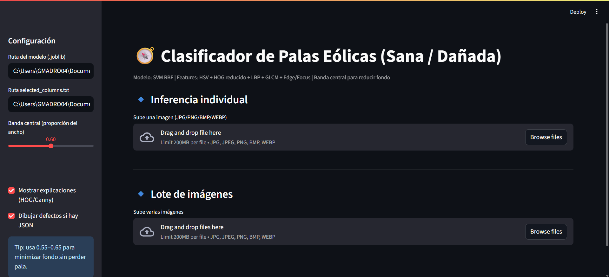

#  Clasificación de Palas Eólicas: Sana vs Dañada

Este proyecto implementa un sistema de **clasificación automática de palas eólicas** usando **Machine Learning** y técnicas de **procesamiento de imágenes**.  
Incluye:
- Extracción de *features* (HSV, HOG, LBP, GLCM, bordes, enfoque).
- Entrenamiento de varios modelos (SVM, Random Forest, MLP, kNN, Regresión Logística).
- **Interfaz interactiva** en Streamlit para predecir el estado de nuevas imágenes.
- Resaltado de zonas dañadas a partir de anotaciones JSON o *heatmaps* explicativos.

> Enlace al repositorio GitHub del proyecto:  https://github.com/gmadro04/PALAS_EOLICAS_ML/tree/master
---

## 📂 Estructura del proyecto
  ```bash
PALAS_EOLICAS_ML/
├───code_modelo # Modelos entrenados (.joblib) y columnas seleccionadas
├───code_procesamiento_datos # Scripts de extracción y curado de        características
├───codigo_interfaz #Script de la interfaz interactiva
├───processed_data # Organizacion de datos (Ent, Val, test)
│   ├───A_defectos_pros
│   ├───B_Sanas_pros
│   ├───data_bin # CSV de features y columnas seleccionadas
│   │   ├───inference_outputs
│   │   ├───test # Datos organizados por split
│   │   │   ├───danadas
│   │   │   └───sanas
│   │   ├───train
│   │   │   ├───danadas
│   │   │   └───sanas
│   │   └───val
│   │       ├───danadas
│   │       └───sanas
│   ├───defectuosas
│   └───no_etiquetadas
└───venvs
└── .gitignore 
└── PALAS_EOLICAS_ML.ipynb # Notebook de entrenamiento 
└── requirements.txt # Archivo que contiene los requisitos del entorno virtual
└── README.md # Este archivo
  ```
# 📚 ¿ Comó usarlo ? 📚
El data set utilizado para entrenar los modelos fue tomado de: https://github.com/cong-yang/Blade30?tab=readme-ov-file. Originalmente este data set no se encuentra totalmente curado, por lo que fue necesario realizar una inspección de las imagenes para poder separar las clases y los datos a usar para entrenar los modelos. Si se desea correr el proceso desde el inicio es necesario descargar el data set original disponible en el enlace anterior y correr los scripts de procesamiento descritos a continuación.
  ```bash
PALAS_EOLICAS_ML/
├───code_procesamiento_datos 
    ├───procesar_img_defectos.py # script que separa img dañadas
    └───procesar_img_noetiqueta.py # Script separa img sin etiqueta
    
  ```
Lo anterior sirve para clasificar y separar las imagenes que estan con etiqueta del data set original que corresponden a 263 imágenes. Las otras 1039 imágenes corresponden a imágenes que no presentan etiquetas, este gurpo del set se encuentra revuelto es decir, ***presenta imágenes dañadas y sanas sin etiquetar***. Por lo tanto es necesario realizar un curado del set separando el set en dos clases __sanas y dañadas__. Este proceso ya fue realizado y separado en carpetas y si no se desea hacer el proceso de curado desde el incio la carpeta que contiene los datos curados y organizados tiene el nombre de ***processed_data*** y esta disponible en el sigueinte enlace para descargarla.

* https://secure.internxt.com/sh/folder/lX4gCIL-TkiSgFQ38y1Q4Q/c44CfFqK 
> Carpeta con los datos curados.

Realizado este paso lo que se debe hacer antes de entrenar los modelos es ejecutar los siguientes scripts en el siguiente orden descrito a continuación 

  ```bash
    py code_procesamiento/prep_dataset_entrenamiento.py
  ```
Este script termina de organizar los datos de entrenamiento y crea las carpetas con las archivos necesarios si no los tiene. Finalmente se extraen caracteristicas y se preparan los datos para entrenar los modelos ejecutando el siguiente script

  ```bash
    py code_procesamiento/extraer_caracteristicas.py
  ```
Luego de esto se crearan los archivos __.csv__ que contienen las caracteristicas para ejecutar el entrenamiento de los modelos.

# 💻 Entrenamiento de los modelos.

Finalizados los anteriores pasos, se debe ejecutar el notebook con el nombre de ***PALAS_EOLICAS_ML.ipynb*** celda por celda, en este notebook se encuentran definidos los parametros utilizados en el entrenamiento de modelos __SVM, K-NN, MLP, Random Forest, Logistic Regretion__. Los resultados de este proceso se resumen a continuación.

<div>
<table border="1" class="dataframe">
  <thead>
    <tr style="text-align: right;">
      <th></th>
      <th>model</th>
      <th>best_params</th>
      <th>pca_used</th>
      <th>pca_components</th>
      <th>pca_var_explained</th>
      <th>train_time_sec</th>
      <th>val_acc</th>
      <th>val_prec</th>
      <th>val_rec</th>
      <th>val_f1</th>
      <th>val_auc</th>
      <th>test_acc</th>
      <th>test_prec</th>
      <th>test_rec</th>
      <th>test_f1</th>
      <th>test_auc</th>
    </tr>
  </thead>
  <tbody>
    <tr>
      <th>0</th>
      <td>SVM_RBF</td>
      <td>{'clf__C': 3.0, 'clf__gamma': 'scale'}</td>
      <td>True</td>
      <td>200</td>
      <td>0.837071</td>
      <td>30.11</td>
      <td>0.8617</td>
      <td>0.8776</td>
      <td>0.86</td>
      <td>0.8687</td>
      <td>0.9091</td>
      <td>0.8936</td>
      <td>0.9348</td>
      <td>0.86</td>
      <td>0.8958</td>
      <td>0.9432</td>
    </tr>
    <tr>
      <th>4</th>
      <td>MLP</td>
      <td>{'clf__alpha': 0.0001, 'clf__hidden_layer_sizes': (128,)}</td>
      <td>True</td>
      <td>200</td>
      <td>0.837071</td>
      <td>4.40</td>
      <td>0.8298</td>
      <td>0.8400</td>
      <td>0.84</td>
      <td>0.8400</td>
      <td>0.8727</td>
      <td>0.8511</td>
      <td>0.8750</td>
      <td>0.84</td>
      <td>0.8571</td>
      <td>0.9441</td>
    </tr>
    <tr>
      <th>3</th>
      <td>kNN</td>
      <td>{'clf__n_neighbors': 3, 'clf__weights': 'uniform'}</td>
      <td>True</td>
      <td>200</td>
      <td>0.837071</td>
      <td>4.75</td>
      <td>0.8191</td>
      <td>0.8367</td>
      <td>0.82</td>
      <td>0.8283</td>
      <td>0.8793</td>
      <td>0.8298</td>
      <td>0.8542</td>
      <td>0.82</td>
      <td>0.8367</td>
      <td>0.9277</td>
    </tr>
    <tr>
      <th>1</th>
      <td>LogReg</td>
      <td>{'clf__C': 0.05, 'clf__penalty': 'l2'}</td>
      <td>True</td>
      <td>200</td>
      <td>0.837071</td>
      <td>4.72</td>
      <td>0.7766</td>
      <td>0.7843</td>
      <td>0.80</td>
      <td>0.7921</td>
      <td>0.8341</td>
      <td>0.8511</td>
      <td>0.8462</td>
      <td>0.88</td>
      <td>0.8627</td>
      <td>0.8982</td>
    </tr>
    <tr>
      <th>2</th>
      <td>RF</td>
      <td>{'clf__max_depth': 20, 'clf__max_features': 'sqrt', 'clf__n_estimators': 200}</td>
      <td>True</td>
      <td>200</td>
      <td>0.837071</td>
      <td>12.05</td>
      <td>0.7872</td>
      <td>0.8261</td>
      <td>0.76</td>
      <td>0.7917</td>
      <td>0.8734</td>
      <td>0.9043</td>
      <td>0.9184</td>
      <td>0.90</td>
      <td>0.9091</td>
      <td>0.9350</td>
    </tr>
  </tbody>
</table>
</div>

El modelo a usar es ***SVM con kernel RBF*** como lo vemos en la tabla es el que mejor resultado dio en los entrenamientos ofrece el mejor balance precisión/performance. Sin embargo se guardan los otros modelos si se desean poner en producción, haciendo uso de la interfaz didactica, que se describe a continuación.

# 💡Aplicación: Uso práctico del modelo SVM-RBF de clasificación

Se diseño una aplicación con una interfaz grafica y didactica para poner a prueba el modelo en un entorno de producción. Para correr esta aplicación se debe ejecutar el script con el siguiente comando.

  ```bash
    streamlit run codigo_interfaz/interfaz_prueba.py
  ```

De esta forma se lanza el aplicativo para poder hacer uso y probar el modelo seleccionado ***SVM_RBF*** o cualquiera de los modelos entrenados. A continuación de adjunta una captura de como se ve esta aplicación y su forma de uso. 



En la aplicación de uso es posee dos opciones posibles: 
1. Cargar __una imágen individual__ : Esta opción carga una imágen y la evalua, adicionalmente muestra el resultado de la clasificación y una visualización gráfica del resultado, donde se resaltan algunas zonas de la imagen donde puede estar el defecto si es que ese fue el resultado.
2. Cargar __lote de imágenes__: Permite evaluar varias imágenes, las evalua y las clasifica, terminado el proceso resume los resultados en un archivo __.csv__ que puede ser descargado para su evaluación si es necesario.

* En la parte lateral izquierda se encunetran opciones de configuración donde se especifica la ruta del modelo a usar y el modelo que se esta usando para la clasificación. Las otras opciones son para habilitar o no la visualización grafica de los resultados en la interfaz. 

> En la carpeta conjunto_ejemplos se encuentra un set de imágenes con las que se puede probar la herramienta, estas imagenes ***NO*** han sido utilizadas en los sets de entrenamiento, validación y testo

---
## 🛠️ Requisitos
- Crea un entorno virtual (recomendación) o puedes ejecutarlo de forma global
- Python 3.9+
- Librerías necesarias:
  ```bash
    # las necesarias 
    pip install streamlit scikit-learn opencv-python-headless pillow numpy pandas matplotlib scikit-image joblib 
    # O se puede ejecutar lo siguiente:
    pip install requirements.txt # esto contiene el paquete completo de las librerias
    ```